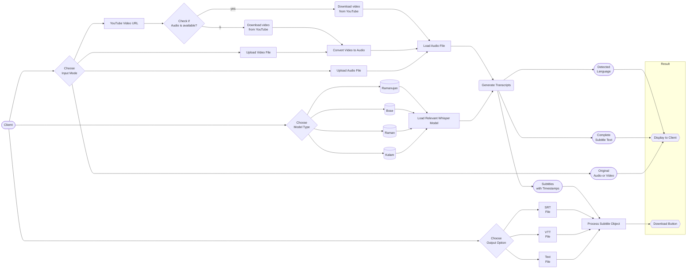
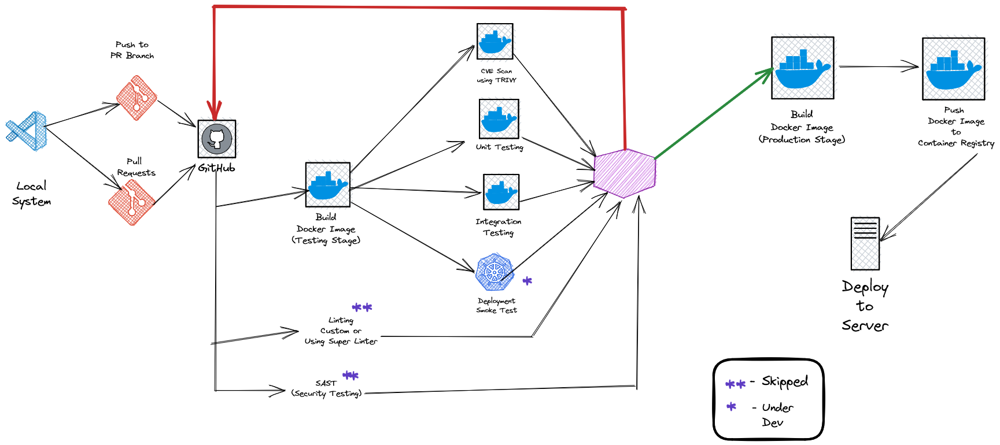

# AI Audio Transcriber

<p align = "center"></p>

A minimalistic application to generate transcriptions for audio built using Python


## 📝 Basic Application WorkFlow 



## 🥊CI/CD

(**Preferred Pipeline Using GitHub Actions for Docker Image**)

<p align = "center"></p>


## ⚒️ Set-Up Instructions

<p align = "center"></p>


- Open your terminal / command prompt. 

- Clone the repository 
    ```
    git clone https://github.com/cirkinkral7/AIAudioTranscriber.git
    ```
- Change the directory to the cloned project
    
    ```
    cd AIAudioTranscriber
    ```

#### **A. Without using Docker**

- Ensure you have any version of [Python](https://www.python.org/downloads/) below 3.10 installed in your system and you have ``virtualenv`` package installed

    ```
    which python
    ```

    ```
    pip install virtualenv
    ```

- Create a new virtual environment
    ```
    python -m venv env
    ```

- Activate virtual enviroment
    - On Mac/Linux
        ```terminal
        source env/bin/activate
        ```
    - On Windows
        ```terminal
        env/Scripts/Activate.ps1 
        ```

- Install ffmpeg in your local syste,
    - On Windows using [Chocolatey](https://chocolatey.org/)
        ```terminal
        choco install ffmpeg
        ```
    - On MacOS using [Homebrew](https://brew.sh/)
        ```terminal
        brew install ffmpeg 
        ```
    - On Debian/Ubuntu
        ```terminal
        sudo apt update && sudo install ffmpeg
        ```
    - On Arch Linux
        ```terminal
        sudo pacman -S ffmpeg 
        ```

- Install the dependencies

    ```
    pip install -r requirements.txt
    ```

- Download the model weights (This will take a few minutes since the total size of models in gigabytes)

    ```
    python get_model_weights.py
    ```

- Run the Web application
    ```
    streamlit run .\Home.py
    ```
    > **Note**:
    > - If the app does not load by itself in your default browser, open a browser of your choice and navigate to  `http://localhost:8501`
    > - To stop the application, press `CTRL + C` in your terminal

#### **B. Using Docker**

- Make sure you have Docker installed on your system. Refer the documentation [here](https://docs.docker.com/desktop/) if you need assistance setting up.
- Build a docker image
    ```
    docker run -t aitranscriber:v0.0.4 .
    ```
    > **Note**:
    > - You may give any name instead of aitranscriber and any tag instead of v0.0.4
    > - Depending on your system it takes a few minutes to successfully build the image
- Once complete, check the docker image
    ```
    docker images
    ```
- Create and run a Docker Container for the image
    ```
    docker run -p 8501:8501 aitranscriber:v0.0.4
    ```
    > **Note**:
    > - `docker run -p <hostport>:<8501> <container_name>:<tag_name>`
    > - In the above command, you can play around with which port of your host system you wish to map to the 8501 port of the container 
    > - If you used a different docker image name and/or different tag, make sure to update it in the command
- Open your preferred Web Browser and navigate to ``http://localhost:8501`` 
    > **Note**:
    > - If you used a different host port in the above command then navigate to that one, ``http://localhost:<host_port>``
    > - To stop the container, in the terminal check the containter name: ``docker ps --all``
    > - Now use container name with the command:  ``docker stop <container_name>``


## 🌏Deployment Options 

<p align = "center"></p>


- Google Cloud Run
    - Install Google Cloud CLI
    - Create an Account on Google Cloud
    - Create a New Project
    - Build and Push Docker Image to Google Container Registry
        ```
        gcloud builds submit --tag gcr.io/<ProjectName>/<AppName>  --project=<ProjectName>
        ```
    - Deploy the Docker Container
        ```
        gcloud run deploy --image gcr.io/<ProjectName>/<AppName> --platform managed --project=<ProjectName> --allow-unauthenticated
        ```

- Amazon EC2 Instance
- Azure App

(**Using Google Colab/Kaggle as temporary MVP server**)

- [pyngrok](https://pyngrok.readthedocs.io/en/latest/index.html)
    - Step 1: Install pyngrok in Google Colab

        ```
        ! pip install pyngrok
        ```
    
    - Step 2: Sign-up in [ngrok](https://ngrok.com/) and get Authentication Token

    - Step 3: Authenticate
        
        ```python
           from pyngrok import ngrok
           ngrok.set_auth_token("xxx")
        ```
    - Step 4: Load the Streamlit App at port 8051, create a tunnel for it and reveal the public URL for the tunnel

        ```python
           !nohup streamlit run app.py --server.port 8051 &
           url = ngrok.connect(8051).public_url
           print(url)
        ```
    
    - Step 5: Share URL with client
     


- [localtunnel](https://github.com/localtunnel/localtunnel)
    - Step 1: Install localtunnel

        ```
        npm install -g localtunnel
        ```
    - Step 2

        ```
        streamlit run Home.py & npx localtunnel --port 8501
        ```
    
    - Step 3: Share URL with client


(**Using local server as temporary MVP server**)

- NGINX + Cloudfare/ngrok

